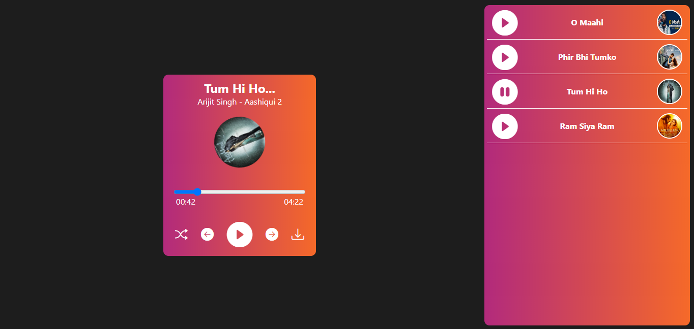
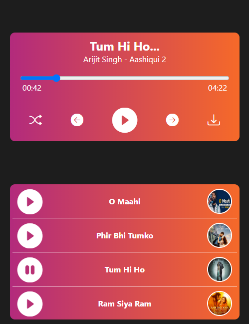

# 🎵 Music Player 🎶

## Overview
This **Music Player** is a beautifully designed and intuitive application built to enhance the music-listening experience. It comes with essential features like play, pause, shuffle, next/previous buttons, and auto-play functionality, all wrapped in a modern UI. Additionally, the **spacebar** can be used to play or pause the music for convenience.

## Features
- ▶️ **Play/Pause Button**: Start or stop the music with a click, or by pressing the **spacebar**.
- ⏭️ **Next/Previous Buttons**: Easily skip to the next or previous track in the playlist.
- 🔀 **Shuffle Button**: Randomize the playlist order for a fresh listening experience.
- 🔄 **Auto-play**: Automatically plays the next track when the current one finishes.
- 🎨 **Beautiful UI**: A clean, modern, and intuitive user interface designed for ease of use.

## Installation and Setup

1. **Clone the repository**:
    ```bash
    git clone https://github.com/dpk763/Music-Player.git
    cd music-player
    ```

2. **Install dependencies**:
    ```bash
    npm install
    ```

3. **Start the application**:
    ```bash
    npm start
    ```

4. Open your browser and go to `http://localhost:3000` to explore the app.

## Usage

1. Click **Play** to start the music or **Pause** to stop it. You can also press the **spacebar** to toggle play/pause.
2. Use **Next** or **Previous** to move through your playlist.
3. Press the **Shuffle** button to randomize track order.
4. The player will **Auto-play** the next track automatically once the current one ends.

## Technologies Used
- **React.js**: Framework for building the user interface.
- **JavaScript**: Logic and interaction management.
- **CSS**: For styling and creating the beautiful UI.
- **HTML5 Audio**: Manages audio playback and control.

## Preview

## Desktop



## Mobile



## Contributing
Contributions are welcome! Feel free to fork the repository, create a new branch, and submit a pull request with improvements or bug fixes.
